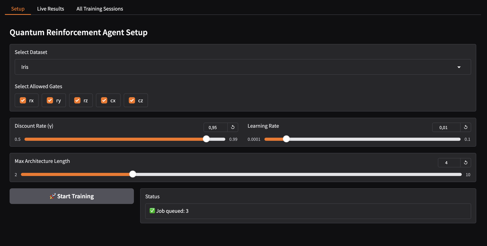

# 🚀 QNNAS Implementation - Installation and Usage Guide

This guide helps you get started with the **Quantum Neural Network Architecture Search (QNNAS)** project, enabling you to configure, run, and extend the system with custom datasets and quantum environments.

---

## 📑 Table of Contents

* [📋 Prerequisites](#-prerequisites)
* [🎯 Getting Started](#-getting-started)
* [📁 Project Structure](#-project-structure)
* [🏗️ Setting Up Your Local Environment](#-setting-up-your-local-environment)
* [⚡️ Running the Training](#-running-the-training)
* [🧠 Adding a New Dataset](#-adding-a-new-dataset)
* [🔧 Utility Commands](#-utility-commands)

---

## 📋 Prerequisites

### 🛠 Local Tools

| Tool   | Version  | Purpose                               | Install                                                                  |
| ------ | -------- | ------------------------------------- | ------------------------------------------------------------------------ |
| Python | 3.11     | Programming language runtime          | [Download Python](https://www.python.org/downloads/release/python-3110/) |
| uv     | ≥ 0.4.30 | Virtual environment + package manager | [Install uv](https://github.com/astral-sh/uv)                            |
| Make   | ≥ 3.81   | Build automation                      | [Install Make](https://www.gnu.org/software/make/)                       |
| Git    | ≥2.44.0  | Version control                       | [Install Git](https://git-scm.com/)                                      |

### ☁️ Cloud Services (Optional)

No cloud services are required for local use.

---

## 🎯 Getting Started

### 1. Clone the Repository

```bash
git clone https://github.com/915-Muscalagiu-AncaIoana/QNNAS-Implementation.git
cd QNNAS-Implementation
```

### 2. Install Dependencies and Prepare Environment

```bash
make install
```

This will:

* Create and activate the virtual environment with `uv`
* Install all Python dependencies from `pyproject.toml`


And then activate the virtual environment created:
```bash
source .venv/bin/activate
```

---

## 📁 Project Structure

```bash
QNNAS-Implementation/
├── best_architectures/         # Saved best circuits per run
├── circuits/                   # Saved circuit diagrams
├── encoders/                   # Encoder/autoencoder models
├── logs/                       # Logging files for background training
├── losses/                     # Loss plots from training
├── models/                     # Trained model weights
├── src/                        # Main source code
│   ├── api/                    # Litestar API definitions
│   ├── data/                   # Dataset and encoder interfaces
│   ├── domain/                 # Database models and enums
│   ├── environment/            # Quantum circuit env logic
│   ├── repositories/           # DB interaction layer
│   ├── training/               # Controller training loop
│   ├── ui/                     # Gradio UI code
│   └── utils/                  # Helper scripts
├── alembic.ini                 # Alembic configuration
├── Makefile                    # Make targets
├── pyproject.toml              # Project metadata and deps
├── README.md                   # Project README
├── INSTALL_AND_USAGE.md        # Installation & usage guide
├── docker-compose.yml          # Optional Docker setup
├── docker-compose-postgres.yml # Postgres config
├── Dockerfile.backend          # API Dockerfile
├── Dockerfile.frontend         # UI Dockerfile
```

---

## 🏗️ Setting Up Your Local Environment

### 1. Initialize the database 

This app uses PostgresSQL as a database, SQLAlchemy as the ORM (Object Relational Mapper) and Alembic for version-controlled migrations.

To start the PostgresSQL database locally using Docker:

```bash
make start-postgres
```

To apply the initial database schema and all migrations (stored in `src/domain`):

```bash
make db-upgrade
```

If you prefer using SQLite or another backend, update the connection string in `domain/db.py` and in `alembic.init` accordingly.


### 2. Start the API Server

```bash
make start-backend
```

This runs the Litestar server locally at:

```
http://localhost:8000
```

Docs available at:

```
http://localhost:8000/schema
```


---

## ⚡️ Running the Training

You can trigger a new training job either via the API, the command line, or using the frontend interface. If you don’t provide a `session_id`, a new training session will be created and assigned a random ID automatically by the backend:

### ✅ From API

```bash
curl -X POST http://localhost:8000/sessions/ \
     -H "Content-Type: application/json" \
     -d '{
           "dataset": "Iris",
           "gates": ["rx", "ry", "cz"],
           "discount": 0.95,
           "lr": 0.01,
           "max_length": 4,
           "encoder_path": "models/autoencoder_iris.pt"
         }'
```

### ✅  From Command Line

```bash
make train DATASET=Iris GATES=rx DISCOUNT=0.9 LR=0.001 MAX_LENGTH=4 ENCODER_PATH=""
```
### ✅ From Gradio Interface

Start the UI:

```bash
make start-ui
```

Then open:

```
http://localhost:7860
```



---

## 🧠 Adding a New Dataset

To add a new dataset:

### 1. Register the Dataset

Update the `DATASET_LOADERS` dictionary inside `src/data/dataset.py` with your custom loader function:

```python
DATASET_LOADERS: dict[str, Callable[[], dict]] = {
    "Iris": load_iris,
    "Digits": load_digits,
    "MyDataset": load_my_dataset  # ← Your custom loader function
}
```

Also, update the `load_dataset_by_name` function if needed to reflect the new loading logic.

### 2. Add Dataset Option to UI 

If you are using the Gradio UI, make sure to also add the new dataset name to the dropdown options in `src/ui/app.py`:

```python
dataset_dropdown = gr.Dropdown(
    label="Select Dataset",
    choices=["Iris", "Digits", "MyDataset"],
    value="Iris"
)
```

### 3. Implement the `BaseAutoencoder` interface (Only if Needed)

If your dataset has more features than available qubits in your simulator, you will need to compress it using an autoencoder. In `encoders/`, create a new class that inherits from the abstract class `BaseAutoencoder` defined in `src/data/encoder_interface.py`:

```python
class MyDatasetAutoencoder(BaseAutoencoder):
    def _build_encoder(self, input_dim, hidden_dim):
        return nn.Sequential(
            nn.Linear(input_dim, 32),
            nn.ReLU(),
            nn.Linear(32, hidden_dim),
            nn.ReLU()
        )

    def _build_decoder(self, hidden_dim, output_dim):
        return nn.Sequential(
            nn.Linear(hidden_dim, 32),
            nn.ReLU(),
            nn.Linear(32, output_dim),
            nn.Sigmoid()
        )
```

This enables a custom way to encode and decode your dataset using PyTorch modules.

### 4. Pretrain the Autoencoder (if applicable)

Train your `MyDatasetAutoencoder` and save the model to:

```
encoders/<name>_encoder.pt
```

You can then pass this path using the `--encoder_path` flag or the API payload to initialize your training job with the compressed dataset representation.

---

## 🔧 Utility Commands

Below is a full list of utility commands available via the `Makefile` for managing the QNNAS project:

| Command                | Purpose                                                             |
| ---------------------- | ------------------------------------------------------------------- |
| `make install`         | Creates a `.venv` environment and installs all project dependencies |
| `make start-backend`   | Starts the Litestar backend server                                  |
| `make start-ui`        | Launches the Gradio frontend UI                                     |
| `make train`           | Runs a training job from the CLI using passed session parameters    |
| `make start-postgres`  | Starts the PostgreSQL database container using Docker Compose       |
| `make stop-postgres`   | Stops the PostgreSQL container                                      |
| `make remove-postgres` | Removes the PostgreSQL container and associated volumes             |
| `make db-migrate`      | Creates a new Alembic migration revision (pass `m="message"`)       |
| `make db-upgrade`      | Applies all Alembic migrations to the database                      |
| `make clean`           | Cleans up `__pycache__`, `.mypy_cache`, and other temporary files   |
| `make lint`            | Runs `ruff` to check for code style and linting issues              |
| `make freeze`          | Saves current environment packages to `requirements.txt`            |


---

## ✅ Done!

You're now ready to explore and extend QNNAS! For issues, feel free to open a GitHub Issue or PR.

---
