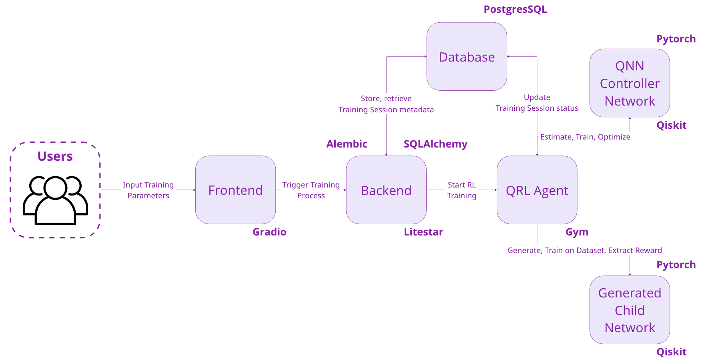
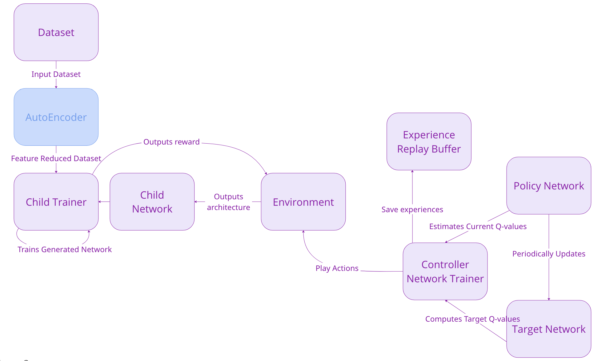

# 🧠 Qubitect: Quantum Neural Network Architecture Search (QNNAS)

This repository contains the implementation for a Quantum Neural Architecture Search framework using Quantum Deep Reinforcement Learning. The project automates the generation and evaluation of quantum circuit architectures tailored for machine learning tasks.

## 📘 About the Paper

This project is based on the research presented in the paper:

> Muscalagiu, Anca-Ioana. *"Quantum Neural Network Design via Quantum Deep Reinforcement Learning."*

### Abstract

Quantum neural networks (QNNs) are a significant advancement at the intersection of quantum computing and artificial intelligence, potentially offering superior performance over classical models. However, designing optimal QNN architectures is challenging due to the necessity for deep quantum mechanics knowledge and the complexity of manual design.

To address these challenges, this work introduces a novel approach to automated QNN design using quantum deep reinforcement learning. Our method extends beyond simple quantum circuits by applying quantum reinforcement learning to design parameterized quantum circuits, integrating them into trainable QNNs. As one of the first methods to autonomously generate optimal QNN architectures using quantum reinforcement learning, we evaluate these architectures on various machine learning datasets to determine their accuracy and effectiveness, aiming to move towards more efficient quantum computing solutions.

## 🧩 Core Features

* **Automatic QNN Design**: A reinforcement learning agent incrementally builds parameterized quantum circuits.
* **Modular Dataset Loader**: Easily add and plug in new datasets.
* **Autoencoder Integration**: Optional pre-trained autoencoders compress high-dimensional data.
* **Training Monitor UI**: A Gradio-based UI visualizes QNN training over time.

## 🧪 Architecture Overview

The framework consists of the following components:

* `src/domain/`: Contains SQLAlchemy ORM models and handles database interaction. Alembic is used for schema migrations. Use `make start-postgres` to launch the database locally and `make db-upgrade` to apply the current schema.
* `src/training/`: Contains the core training loop, reinforcement learning agent logic, reward evaluation, and QNN model construction using PennyLane.
* `src/data/`: Provides dataset loading utilities and defines the `BaseAutoencoder` interface. New datasets and encoders should be registered here.
* `src/environment/`: Encapsulates the OpenAI Gym-compatible environment where the agent interacts and constructs circuits.
* `src/repositories/`: Contains repository abstractions for database queries and operations.
* `src/api/`: Implements the Litestar backend, which provides endpoints to trigger and manage training sessions via HTTP API.
* `src/ui/`: Implements the Gradio-based live visualization interface, which monitors training progress in real time.
* `src/utils/`: Helper functions, logging utilities, and shared utilities used across modules.

Additionally:

* `encoders/`: Includes custom PyTorch-based autoencoders that inherit from `BaseAutoencoder`. These are used when input features exceed the number of available qubits.

---

### 🧩 Qubitect System Architecture

The following diagram illustrates the high-level system architecture that wraps the full QNNAS pipeline:



*Figure: End-to-end architecture of Qubitect.*

---

### 🧠 Methodology Overview

The overall workflow of the QNNAS method integrates deep reinforcement learning to iteratively construct quantum neural networks (QNNs), using the following methodology:



*Figure: High-level architecture of the QNNAS framework integrating circuit generation, evaluation, and reinforcement learning.*

## 📌 Citation

If you use this repository or build upon the ideas in the paper, please cite:

```bibtex
@article{muscalagiuquantum,
  title={Quantum Neural Network Design via Quantum Deep Reinforcement Learning},
  author={Muscalagiu, Anca-Ioana}
}
```

## 📬 Contact

For questions, ideas, or contributions, feel free to open an issue or reach out directly via the Issues tab.

Check out the [INSTALL\_AND\_USAGE.md](INSTALL_AND_USAGE.md) guide for full instructions on how to set up, run, and extend the QNNAS tool for new datasets, autoencoders, and backend configurations.
